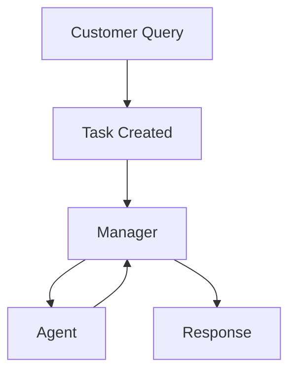

# Customer Service Agent Using CrewAI

A crew of 4 agents, excluding the manager, to perform customer service effectively.

## Types of Agents

Agents are initialized with a role, goal, and backstory. 

1. Accounting Agent: Manages financial records, billing, and payment discrepancies while ensuring regulatory compliance.

2. Technical Support Agent: Diagnoses and resolves technical issues, guiding customers through solutions in non-technical terms.

3. Marketing Agent: Communicates promotions and marketing campaigns, driving engagement and ensuring consistent brand messaging.

4. Human Resource Agent: Manages staffing to efficiently meet customer demand, ensuring optimal team performance and avoiding overwork.

## Tasks

Customer queries are accepted as tasks with a description and expected output.

## Types of Managers

A manager delegates the task to members of the crew based on the functionalities of the agent in the crew. It is important to ensure that the process category is "hierarchical" when using a manager. A manager can be of two types:

1. LLM (passed to manager_llm)

2. Custom Manager Agent (passed to manager_agent)

## Flowchart

- A customer submits a query.
- A task is created based on the query.
- The manager delegates the task to an agent.
- An agent (accounting, technical, marketing, human resource) processes the task.
- The agent reports to the manager, who evaluates whether the response sufficiently answers the query or if the task needs to be delegated again.
- The manager provides a final response to the customer.
