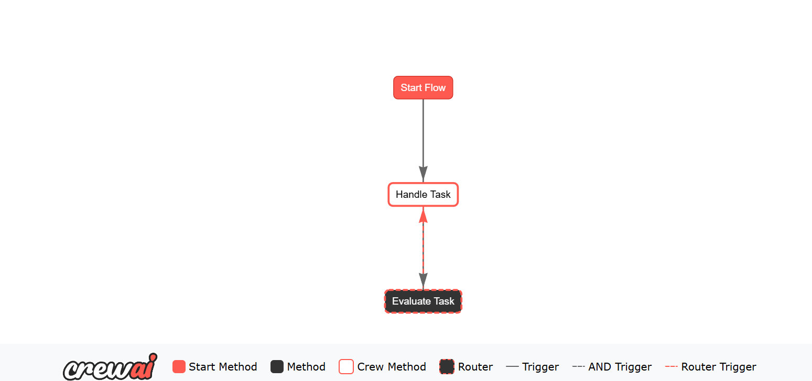

# Evaluating Customer Service Using CrewAI

A crew of 4 agents for Customer Service and an Evaluation Agent. 

## Evaluation Agent

Evaluation Agent is initialized to evaluate any kind of response from the Customer Service. It has its own evaluation task in eval_tasks.yaml, which has a variable {last_answer} as the last task output from the crew. Based on this and instructions from the task description, it will always respond with a JSON with keys "approved" and "feedback". If the approved value is True, the Flow will end. If the value is False, the crew will look to improve on the response {last_answer} based on {feedback}.

## Flowchart

This is the plot from using the plotting feature of Flows. Handle Task is the task completed by the crew based on the customer query.
Evaluate Task is for the Evaluation Agent. Any time the "approved" value isn't True, Handle Task is activated with the feedback as input. When "approved" is True, exit() is used.

## Issues and Next Steps

While we talked about how using a Hierarchical Process is better than Sequential, right now I can't make it work with Hierarchical. Any time the loop goes back to Handle Task, error about Manager not being able to use tools comes up. Only fix I found for it, is to change the CrewAI file that throws the error. Example Flow projects created by CrewAI all use Sequential, possibly for this reason then.

In addition to fixing this issue, here are some next steps I see:

1. Understanding better how to create the best evaluator. Right now there is a very fine line between always approving the first response and looping very long until a satisfiable one comes. 

2. Starting to use tools like the LLM-as-a-judge evaluators.

3. Making the Evaluation Crew more generalizable, so that it can be just added easily to any task.